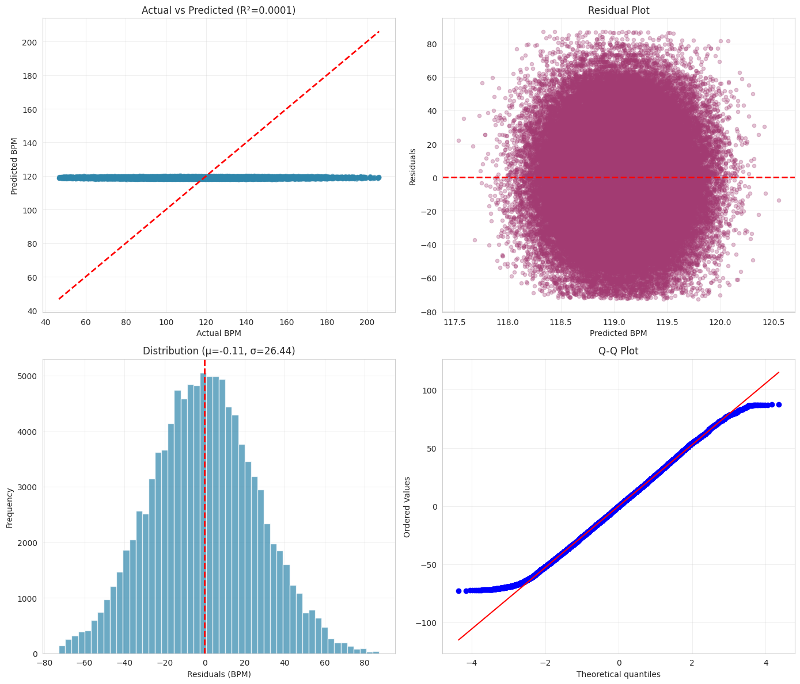

# Beats Per Minute (BPM) Prediction
Can we predict the tempo of a song using its musical characteristics?

## Project Overview
The primary objective of this project was to build a regression model to predict the Beats Per Minute (BPM) of music tracks based on musical characteristics for each track(e.g., Energy, Instrumental Score, Mood Score).

The data for this project was sourced from a Kaggle competition and consists of generated (synthetic) data. Despite utilizing a wide range of architectures from simple linear baselines to GPU-accelerated ensemble methods, comprehensive analysis suggests that this synthetic dataset contains significant noise and that the provided features possess no statistical correlation with the target tempo. This repository documents the Exploratory Data Analysis (EDA), preprocessing pipelines, and model benchmarking that led to this conclusion.

## Model Evaluation Summary

Eight models were evaluated, ranging from simple linear baselines to GPU-accelerated ensemble methods. As anticipated from the exploratory data analysis (EDA), the dataset exhibits an extremely low predictive signal and high levels of noise.


| Model                    | Test RMSE | Test R²     | Test MAPE (%) |
|--------------------------|-----------|-------------|---------------|
| Ridge Regression         | 26.44     | 0.00008     | 19.79         |
| Linear Regression        | 26.44     | 0.00008     | 19.79         |
| Polynomial (Interaction) | 26.44     | 0.00001     | 19.79         |
| Lasso Regression         | 26.45     | -0.00002    | 19.79         |
| MLP (Neural Network)     | 26.45     | -0.00025    | 19.83         |
| CatBoost                 | 26.46     | -0.00148    | 19.80         |
| LightGBM                 | 26.48     | -0.00237    | 19.81         |
| XGBoost                  | 26.53     | -0.00658    | 19.85         |


### Best Performing Model
- **Ridge Regression**
  - **Test RMSE:** 26.44  
  - **R²:** ≈ 0.0001  

The following diagnostic plots illustrate the behavior of the best performing model(Ridge Regression)



**Figure:** Diagnostic plots for Ridge Regression. 

- Top-left: Actual vs. Predicted BPM showing predictions collapsing around the global mean.  
- Top-right: Residuals vs. Predicted BPM indicating random dispersion with no systematic structure.  
- Bottom-left: Residual distribution approximating a normal distribution centered near zero, this reflects the natural variability of the target rather than learned structure. 
- Bottom-right: Q–Q plot showing deviations at the tails, consistent with noise-dominated error.

### Performance of Complex Models
- Non-linear models (XGBoost, LightGBM, MLP) failed to outperform the baseline.
- These models produced **negative R² values**, suggesting overfitting to noise rather than learning meaningful patterns.
- This outcome reinforces the conclusion that increased model complexity does not improve performance in low-signal datasets.

  **Conclusion:** The inability of any model to exceed an $R^2 > 0.01$ provides strong evidence that the available features in this dataset contain no meaningful predictive information for BPM.

## Project Structure 
```
├── notebooks/
│   ├── 01_exploratory_data_analysis.ipynb
│   ├── 02_data_preprocessing.ipynb
│   └── 03_model_training_and_evaluation.ipynb
│
├── scripts/
│   └── preprocessing.py
│
├── figures/
│   └── ridge_diagnostics.png
│
└── README.md
```
